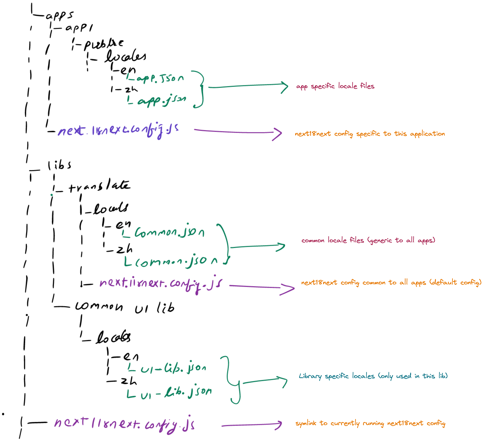

# nx-sample-react
This is an nx sample project which contains sample implementation for below scenarios.
1. How to use theme using `emotionJS` frameworks? Theme & icons needs to be different for different projects.
2. How to implement localisation using `next-i18next`?
  a. How to keep locale files common to libs?
  b. How & where to locate locale files for specific libs?
  c. How to consume libs with translation.

## Tech stacks
1. Nx
2. React
3. NextJS
4. TypeScript
5. emotion
6. next-i18next
## Localisation using next-i18next
Create a common lib which handles translation related common functionalities. In our case it is named `translator`.

### Folder Structure
### Rules followed
* Keep app specific config & locales in app folder
* Keep locales & configs common to all apps in `translator` lib.
* Keep locales specific to any UI component lib in the same lib



### How it works?

1. `Translator` lib wraps the default i18n behavious & add the default configs to i18n functions.
2. Custom executor called `copy-locales` is performs below functions on serve & build.
    i. Create symlink in root folder for currently running app's nexti18next.config.js config.
    ii. Copy locales from dependent libs of the folder to application's `public/locales` folder
3. So by default locales & configs are consumed from the respective locations.

### What you should do?
1. Follow the given folder structure.
2. Add `locales` target in the newly created application's `project.json` folder. Use below code block
    ```
    "locales": {
      "executor": "./tools/executors/copy-locales:copy-locales",
      "options": {
        "libs": ["translator", "lib1"]
      }
    }
    ```
3. Add `locales` are the dependency to your applicaiton's `serve` and `build` targets.
  ```
  "dependsOn": [
    {
      "target": "locales",
      "projects": "self"
    }
  ]
  ```